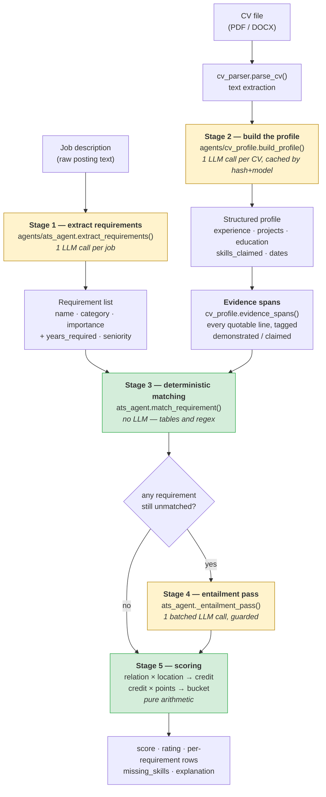
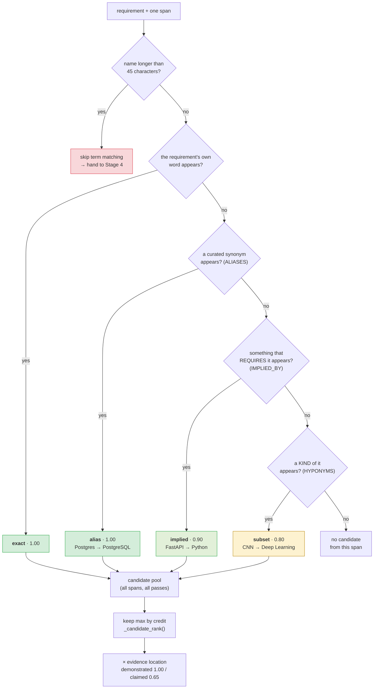
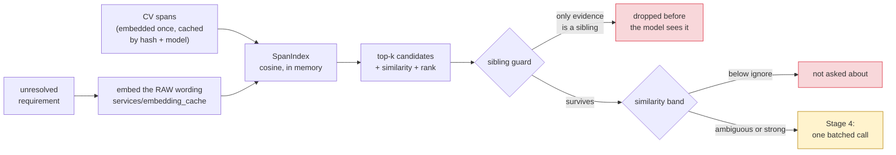
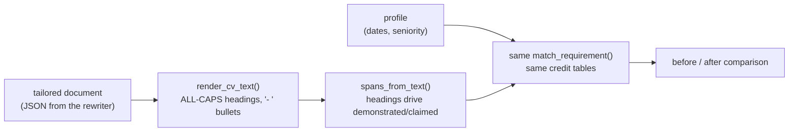

# How a CV is matched against a job description

This is the technical walkthrough of the matching engine: what happens between
"here is a CV" and "this job scores 82%", which parts are a language model and
which are arithmetic, and why the boundary sits where it does.

Two claims shape the whole design:

1. **A score you cannot audit is not a score.** Every point awarded traces back
   to a line of the CV, so the final number is computed in Python from a table
   of credits — never asked of a model.
2. **The model reads; the code decides.** Language models are used exactly
   twice per job, both times to turn prose into structure. They never see a
   weight, never return a number that reaches the score, and never get the last
   word on whether a requirement is met.

---

## The pipeline



Yellow is a language model. Green is arithmetic. The two green boxes decide the
score. Between stages 3 and 4 sits a third kind of thing — local semantic
retrieval, described under *Stage 3b* below — which is neither: it runs no
model call and makes no decision, it only chooses which lines the adjudicator
is shown.

**Cost per job: two LLM calls** — one to read the posting, one for whatever the
tables could not resolve. The CV parse is hoisted out of the loop and cached on
`hash(cv_text) + model`, because your CV changes rarely and postings change
every time.

---

## Stage 1 — the posting becomes a list of requirements

`extract_requirements(job_description)` asks the model for structure, not
judgement:

```json
{"requirements": [
   {"name": "Python", "category": "technical_skill", "importance": "required"},
   {"name": "Computer vision", "category": "domain_knowledge", "importance": "required"}
 ],
 "years_experience_required": 3,
 "seniority": "mid"}
```

`category` fixes what the requirement is *worth*, `importance` fixes which
bucket it lands in. Both come from a fixed vocabulary, so a hallucinated
category cannot invent a new weight.

---

## Stage 2 — the CV becomes a profile, then evidence spans

The CV is parsed once into structured entries (roles with dates, projects,
education, a skills list). Two things come out of it.

**Years of experience** are computed from *merged date intervals* — two
concurrent roles count once — rather than `max(year) − min(year)` over every
number in the document, which used to read a graduation year and a certificate
date as six years of employment.

**Evidence spans** are the unit everything else matches against. Every line of
the CV becomes a span carrying where it came from:

| span text | source | `demonstrated` |
|---|---|---|
| `Developed a multimodal pipeline … using a vision-language model.` | experience | **true** |
| `Built an autonomous multi-agent system of 8 specialized agents …` | project | **true** |
| `Computer Vision` | skills | **false** |

That flag is the difference between a skill you *used* and a skill you *listed*,
and it is worth 35% of the credit. A CV that pastes the job description into a
keyword row must not outscore one that describes the work.

---

## Stage 3 — deterministic matching

For each requirement, every span is checked four ways. Nothing stops at the
first hit: the matcher collects **every** way a requirement could be satisfied
and then keeps the highest-credit one, so the ranking lives in a table you can
read rather than in the order of a loop.



The four relations, in `agents/skill_matching.py`:

| relation | table | question it answers | credit |
|---|---|---|---|
| `exact` | — | does the requirement's own word appear? | 1.00 |
| `alias` | `ALIASES` | is this another **name** for the same thing? | 1.00 |
| `implied` | `IMPLIED_BY` | could this work have happened **without** it? | 0.90 |
| `subset` | `HYPONYMS` | is this a **kind of** it? | 0.80 |

`IMPLIED_BY` and `HYPONYMS` are directional and only ever read
requirement → evidence. "FastAPI implies Python" never becomes "Python implies
FastAPI".

### The guards, and what each one is for

Every one of these exists because something got scored that should not have
been:

- **Word boundaries, not substrings.** `"R"` matched inside "Tarek" and
  "Director" under `skill.lower() in cv.lower()`. Boundaries are computed with
  explicit lookarounds rather than `\b`, because `\b` is defined against `\w`
  and would break `C++`, `C#` and `Node.js`.
- **Exclusive groups.** Members of `EXCLUSIVE_GROUPS` — AWS/GCP/Azure,
  PyTorch/TensorFlow, Python/Java — can never satisfy each other, however
  related an embedding model thinks they are. This is the specific failure that
  makes cosine similarity unusable here: AWS and GCP are near-identical vectors
  *because* they are the same kind of thing, which is exactly why one is not
  evidence of the other.
- **False friends.** Same letters, different skill. "Developed a LangGraph
  **ReAct** agent" scored a `React` requirement at full credit — and then, since
  React implies JavaScript, invented a JavaScript row on a CV with no frontend
  work. `FALSE_FRIENDS` rejects the *occurrence*, not the document: a CV naming
  both a ReAct agent and a React console still scores React.
- **Typography folding.** A rewrite comes back with U+2011 non-breaking hyphens
  and curly apostrophes — invisible on the page, fatal to a comparison. Dashes,
  spaces and quotes are folded 1:1 (length-preserving, so evidence snippets stay
  aligned) before any match.

---

## Stage 3b — semantic retrieval (local, no LLM)

Deterministic matching settles named things. It structurally cannot settle the
other half of a posting: "stakeholder management", "requirements gathering",
"campaign performance analysis" — phrased differently in every posting,
demonstrated by CVs that never use the phrase, and impossible to enumerate in
any table. Those are typed `capability` at extraction and skip Level A
entirely.

For every requirement Level A leaves unresolved, retrieval embeds the
posting's own wording, searches the candidate's spans, and returns the closest
few:



Three properties make this safe to add:

- **Retrieval nominates; it never scores.** A candidate that never reaches the
  LLM is worth nothing. Even a near-duplicate line in the `strong` band still
  has to be adjudicated — accepting on similarity alone would put points on
  the one signal that provably cannot tell AWS from GCP, since those are
  near-identical vectors precisely *because* they are the same kind of thing.
- **Siblings are dropped before the model is asked.** A "deployed to Google
  Cloud" line is necessarily among an AWS requirement's nearest neighbours. It
  is removed from the shortlist rather than offered and refused, so the model
  never gets the opportunity.
- **It costs no extra LLM call.** The adjudication call was already being made;
  it is now shown five relevant lines per requirement instead of the first
  eighty lines of the CV. Span vectors are cached on
  `hash(normalised text) + model`, so a CV is embedded once and reused across
  every job.

The embedding model is **nomic-embed-text** running locally in Ollama: 768
dimensions, 8K context, fast enough on CPU to embed every span and every job
description. It requires a task prefix on both sides — `search_query: ` for
the requirement, `search_document: ` for CV spans — and the model card is
explicit that this is not optional, so the prefix is applied per call site and
is part of what the cache hashes. It is English-centric, which is the tradeoff
against `qwen3-embedding:4b` for the Arabic and mixed-language postings on the
MENA boards; switching is one line in `.env`, and every cache key includes the
model so vectors from two models can never be compared.

With no embedding provider reachable — Ollama not running, no API key, network
down — every one of these paths returns nothing and the pipeline falls back to
exactly the behaviour documented here. Scoring never depends on it, and
`result["retrieval"]` says what happened either way.

---

## Stage 4 — the entailment pass

Whatever the tables could not resolve goes to the model in **one batched call**
covering every unresolved requirement — not one call each, which fits no free
tier this project runs on. The prompt asks a directional question ("does this CV
line *demonstrate* this requirement?"), never "are these related".

Two guards run on the answer before it can score:

- **The quote must be real.** A verdict citing a line that is not in the CV — a
  paraphrase, or a plausible invented bullet — is discarded.
- **Siblings are rejected anyway.** If the model justifies `AWS` with "has
  Google Cloud experience", the verdict is thrown out regardless of its
  confidence. The exclusive-group guard runs *after* the model, not instead of
  it.

Anything surviving is credited `semantic_support` (0.75) at `demonstrated` —
never `alias`, because an unverifiable judgement should not earn what a curated
synonym earns.

> **Reading a `semantic_support` row as a bug report.** The model only sees what
> Stage 3 failed to resolve. A confident verdict here usually means the
> vocabulary is missing a word, and the 0.75 cap is then punishing the tables
> rather than the candidate. "Agentic AI solutions" against a bullet reading
> "autonomous multi-agent system of 8 specialized agents" scored 6.75/9 this way
> until `agentic ai` was added with its naming variants — it now resolves
> deterministically at 9/9. Check the tables before touching any credit.

---

## Stage 5 — arithmetic

```
credit  = RELATION_CREDIT[relation] × EVIDENCE_MULTIPLIER[location]
points  = REQUIREMENT_POINTS[category] × credit
bucket  = Σ points earned ÷ Σ points possible
score   = Σ (bucket score × bucket weight)
```

**Relation × location** — two independent axes, because one enum cannot say that
an exact term buried in a skills list is weaker than a prerequisite inside a
dated role:

| | demonstrated (1.00) | claimed (0.65) |
|---|---|---|
| exact / alias (1.00) | **1.00** | 0.65 |
| implied (0.90) | **0.90** | 0.585 |
| subset (0.80) | **0.80** | 0.52 |
| semantic_support (0.75) | **0.75** | — |
| none (0.00) | 0.00 | 0.00 |

Read down the demonstrated column and across to claimed: **every relation backed
by real work outranks a bare listed keyword.** That ordering is asserted by a
test, because it was once the other way round.

**Points by category** — a required language is not worth the same as a
nice-to-have tool: `technical_skill` 10, `experience` 10, `domain_knowledge` 9,
`education` 9, `certification` 6, `tool` 6, `responsibility` 5, `soft_skill` 2.

**Buckets** — every requirement lands in exactly one, which is what keeps the
published weights honest:

| bucket | base weight | holds |
|---|---|---|
| Required skills & tools | 45% | everything `required` that is not experience/education/responsibility |
| Experience & seniority | 20% | years, from merged date intervals |
| Preferred skills & tools | 15% | the same, `preferred` |
| Responsibilities alignment | 10% | `responsibility` requirements |
| Education & certifications | 10% | `education`, `certification` |

**Inactive buckets redistribute.** A posting that states no education
requirement is not a posting the candidate failed: the bucket drops out and its
weight is shared across the buckets that do apply, proportionally.

---

## A worked example

Real code, real output — this is `compute_requirements_score()` run on the
profile and posting below, with the entailment call disabled so every number is
reproducible.

### The posting (after Stage 1)

| requirement | category | importance | worth |
|---|---|---|---|
| Python | technical_skill | required | 10 |
| Computer vision | domain_knowledge | required | 9 |
| SQL | technical_skill | required | 10 |
| Agentic AI solutions | domain_knowledge | preferred | 9 |
| Kubernetes | tool | preferred | 6 |
| Bachelor's degree | education | required | 9 |

`years_experience_required: 3`, `seniority: mid`. No responsibilities are
stated, so that bucket will drop out.

### The CV (after Stage 2)

```
EXPERIENCE
AI Research Intern · Manipal Institute of Technology · Jul 2025 – May 2026
- Developed a multimodal pipeline that generates radiology reports from 3D chest
  CT scans using a vision-language model.
- Trained a 3D ResNet-50 encoder with MoCo self-supervised learning and aligned
  CT features with radiology text using CLIP contrastive learning.

Full-Stack Developer · Notopia · Oct 2024 – Jan 2025
- Contributed across the full application lifecycle, including Flutter frontend
  development, NestJS backend services and REST APIs, and PostgreSQL database
  integration.

PROJECTS
Job Application Agent · Feb 2025 – Jan 2026
- Built an autonomous multi-agent system of 8 specialized agents for job search,
  ATS scoring and CV rewriting, coordinated through a LangGraph orchestrator.

EDUCATION
Bachelor's degree, Computer Science · Ain Shams University · 2022 – 2026

TECHNICAL SKILLS
Python, SQL, Computer Vision, Kubernetes, PyTorch
```

13 spans come out of that: 8 demonstrated (roles, bullets, project, degree) and
5 claimed (the skills row). Merged professional intervals total **1.2 years**.

### Stage 3 output

| requirement | relation | location | credit | points | why |
|---|---|---|---|---|---|
| Python | `implied` | demonstrated | 0.90 | **9.0** / 10 | "langgraph" requires Python, so this work used it |
| Computer vision | `implied` | demonstrated | 0.90 | **8.1** / 9 | "vision-language model" requires computer vision |
| SQL | `implied` | demonstrated | 0.90 | **9.0** / 10 | "postgresql" requires SQL |
| Agentic AI solutions | `alias` | demonstrated | 1.00 | **9.0** / 9 | "multi-agent system" is a synonym |
| Kubernetes | `exact` | claimed | 0.65 | **3.9** / 6 | in the skills list only — no role or project mentions it |
| Bachelor's degree | `exact` | demonstrated | 1.00 | **9.0** / 9 | the education entry |

Four of these six are worth reading closely:

- **Python** is never written in a bullet. It is in the skills row, which alone
  would earn `exact × claimed` = 0.65. But the project says LangGraph, and
  nobody writes a LangGraph orchestrator without writing Python — so the row is
  promoted to `implied × demonstrated` = 0.90, and the evidence shown is the
  bullet, not the keyword.
- **Computer vision** is the same shape: listed in the skills row, and evidenced
  by "vision-language model" in a dated internship bullet. Before that term was
  in the tables this scored 5.85/9; it now scores 8.1/9 on identical text.
- **Agentic AI solutions** never appears in those words anywhere on the CV.
  "Multi-agent system" is a naming variant of the same field, so it is an alias
  — full credit, deterministically, with no LLM call.
- **Kubernetes** stays at 0.65 and that is the correct answer. It is listed and
  nothing on the CV shows it being used. Docker in a project bullet would *not*
  rescue it: orchestrating containers is a different skill from building them,
  and `IMPLIED_BY` deliberately excludes that pair.

### Stage 5 arithmetic

```
required_skills   (9.0 + 8.1 + 9.0) / (10 + 9 + 10)  = 26.1 / 29 = 0.900
preferred_skills  (9.0 + 3.9)       / (9 + 6)        = 12.9 / 15 = 0.860
education          9.0              / 9              =             1.000
experience        years   min(1, 1.2/3)  = 0.400
                  seniority  1.2 / 2     = 0.600      → mean       0.500
```

Responsibilities is inactive, so its 10 points of weight are redistributed
across the four active buckets — each keeps its share of the remaining 90%:

```
required   0.45 / 0.90 = 0.5000     preferred  0.15 / 0.90 = 0.1667
experience 0.20 / 0.90 = 0.2222     education  0.10 / 0.90 = 0.1111

score = 0.5000 × 0.900
      + 0.2222 × 0.500
      + 0.1667 × 0.860
      + 0.1111 × 1.000
      = 0.8156   →   82%, "Excellent"
```

The experience bucket is what holds this back: 1.2 years against a posting
asking for 3. That is a fact about the candidate, not about wording, and no
rewrite can move it — which is exactly the separation the buckets exist to
preserve.

---

## Scoring a *tailored* CV

The same engine runs on the rewrite, with one difference: there is no second
LLM parse. The no-fabrication rule means a rewrite cannot change the work
history, so dates come from the profile already built, and evidence is read
structurally out of the rendered text by `cv_profile.spans_from_text()`.



Two readers on the two sides of one comparison is a place bugs hide, and both
of the ones found so far lived here:

- `Tools & DevOps: Git, Docker` was classified as a section *heading* (the
  skills pattern matches "tools") and discarded, so both skills scored
  `Not found` on a CV that prints them. A labelled line is now a heading only
  when the label is exactly a section name — and its payload is kept either way.
- The typography fold described above. Without it the entailment pass could not
  verify its own quotes against the rewritten text, and every verdict was
  discarded as invented.

If a requirement is credited on the master CV and `Not found` on the tailored
one, suspect the reader or a deletion by the rewrite — not the wording.

---

## What the score means

The number alone cannot answer the question a candidate actually has. Two
people scoring 0.62 can be in opposite situations: one has the experience and
describes it in the wrong words, the other is three years short. So every
scored job also carries a deterministic verdict (`agents/recommendation.py`)
that separates:

| bucket | meaning | who can fix it |
|---|---|---|
| **strengths** | full credit, evidenced | — |
| **wording gaps** | the profile HAS this; the posting's word is missing | a tailored CV, truthfully |
| **gaps** | nothing in the profile supports it | only the candidate |
| **hard failures** | a required credential, or a years bar not met | nobody, before this application |

That split is a safety boundary, not a presentation choice. The CV rewriter
reads it to decide what it may write, and a gap marked unfixable is one it must
not close — closing it means fabricating experience.

It also reports a **tailoring ceiling**: the score this CV would reach if every
wording gap closed to full credit and nothing else changed, computed with the
scorer's own weights and points. The distance between the score and the ceiling
is the honest value of tailoring. Everything above the ceiling would be a lie.

---

## Measuring it

`bench/matching_cases.json` is a labelled dataset — every failure mode this
engine has ever had, plus capability cases across seven job families — and
`tests/test_golden_dataset.py` runs it as a gate. `python -m bench.report`
prints the measurement:

```
Level A — deterministic (23 cases)
  precision 1.000   recall 1.000   f1 1.000
  tp 14  fp 0  fn 0  tn 9
```

Precision is the number that must not move. A false positive is a point
awarded for evidence the candidate does not have, and no amount of extra recall
pays for one.

`python -m bench.report --calibrate` goes further and derives the two
similarity thresholds from measurement instead of intuition. It builds every
labelled requirement/span pair in the dataset — including the hard negatives:
sibling technologies, and adjacent-but-different capabilities like *statutory
audit* against a budgeting line — embeds them with whatever provider is
configured, and applies one stated rule:

- **classes separate** (no negative reaches the lowest positive): the floor
  goes inside the gap, biased low, and the strong band starts at the lowest
  positive.
- **classes overlap**: the floor goes just under the lowest positive. The
  asymmetry is deliberate — a positive under the floor is an unrecoverable
  miss, since retrieval is the only path a capability has and nothing
  downstream can retrieve what retrieval never returned, whereas a negative
  above it only costs a line in a prompt the adjudicator then rejects.

It prints the `.env` lines to paste, the current values beside them, and the
closest pairs so a surprising number can be traced to the sentence that caused
it. An overlap is a finding rather than a failure: it means the thresholds
cannot do this work under this model and the adjudication call is carrying it —
which is why nothing here scores on similarity alone.

At runtime the same concern is watched cheaply: `result["retrieval"]` reports
the observed similarity distribution and raises a `calibration_warning` for the
two degenerate shapes — nothing retrieved for any requirement (floor too high,
retrieval silently off) or every candidate in the strong band (floor below what
the model scores unrelated text, so the shortlist is just the first k spans).

---

## Where everything lives

| file | responsibility |
|---|---|
| `agents/ats_agent.py` | `extract_requirements`, `match_requirement`, `_entailment_pass`, `compute_requirements_score` — the pipeline |
| `agents/skill_matching.py` | `ALIASES`, `HYPONYMS`, `IMPLIED_BY`, `EXCLUSIVE_GROUPS`, `FALSE_FRIENDS`, `find_term`, `fold_typography` — the vocabulary and the guards |
| `agents/cv_profile.py` | `build_profile`, `evidence_spans`, `spans_from_text`, `professional_years`, `demonstrated_skills` |
| `config.py` | `RELATION_CREDIT`, `EVIDENCE_MULTIPLIER`, `REQUIREMENT_POINTS`, `JOB_MATCH_WEIGHTS`, `match_credit()` — every number |
| `agents/cv_targeting.py` | turns the same tables into rewrite instructions |
| `agents/matching_types.py` | `Requirement`, `EvidenceSpan`, `SemanticCandidate` — the DTOs the layers pass each other |
| `agents/requirement_normalizer.py` | canonical name, requirement type, concept family — what decides which level a requirement is routed to |
| `agents/evidence_retrieval.py` | embed, search, return candidates. Cannot decide anything |
| `agents/semantic_matching.py` | the guards and confidence routing on top of retrieval |
| `agents/recommendation.py` | strengths, wording gaps, genuine gaps, hard failures, tailoring ceiling |
| `services/embedding_cache.py` | vectors cached by `hash(normalised text) + model`; never raises |
| `services/semantic_index.py` | the cosine index over one candidate's spans |
| `bench/` | the golden dataset, the score regression, and `report.py` |

**To debug a row you disagree with:** open the requirement table in the ATS
bench. It shows the relation, the location, the credit and the exact CV line
behind every point. A row that looks wrong is one of four things — a missing
table entry (most common), a false friend, a span that was not read, or a credit
you would calibrate differently. The first three are bugs; only the fourth is a
matter of opinion.
