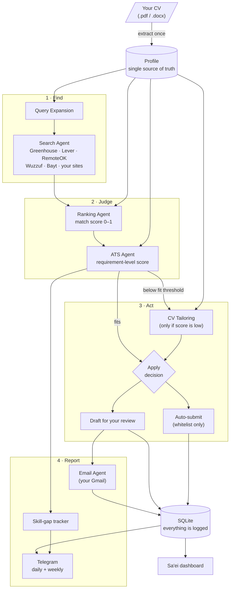
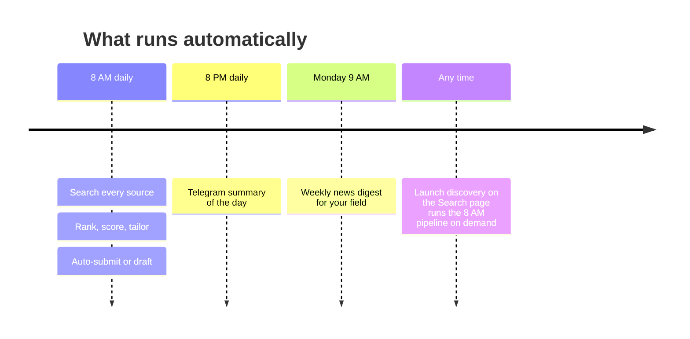
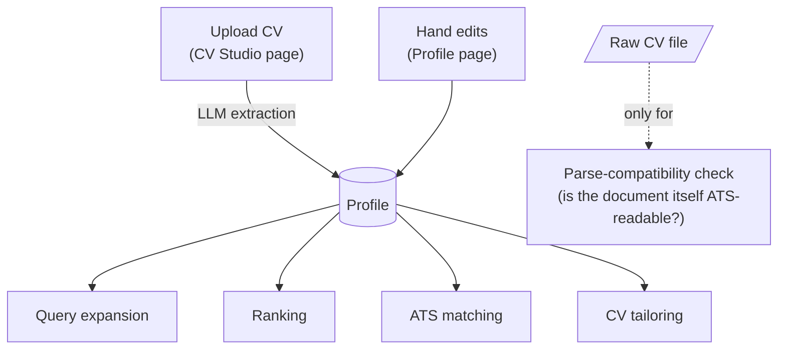
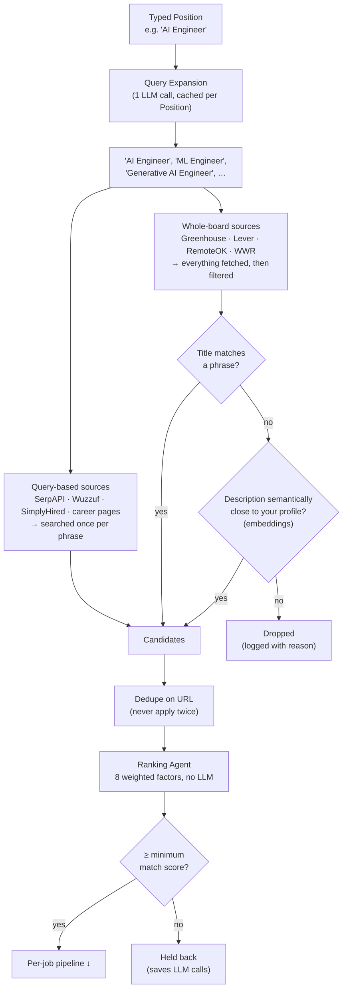
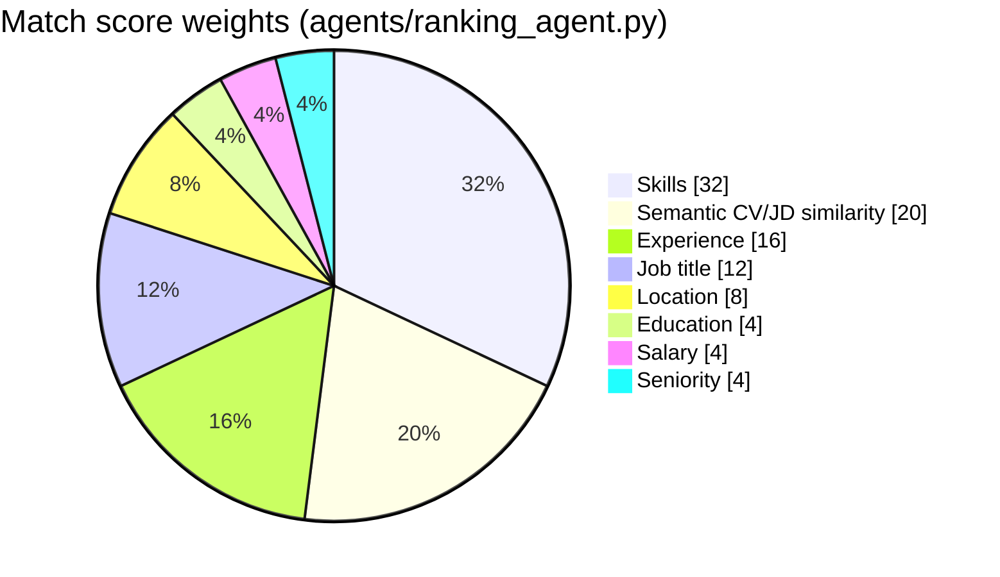
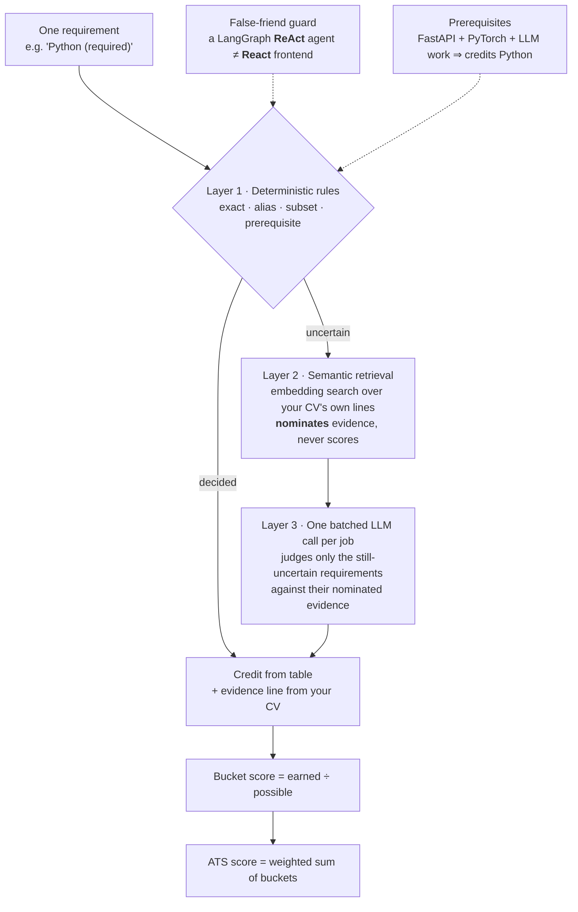
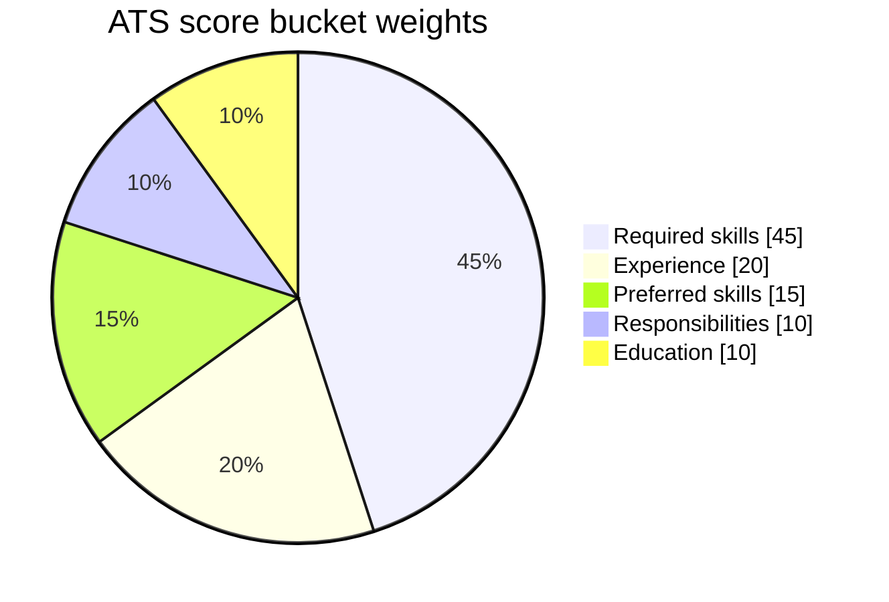
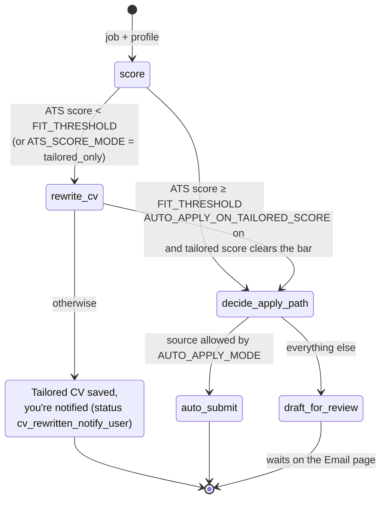
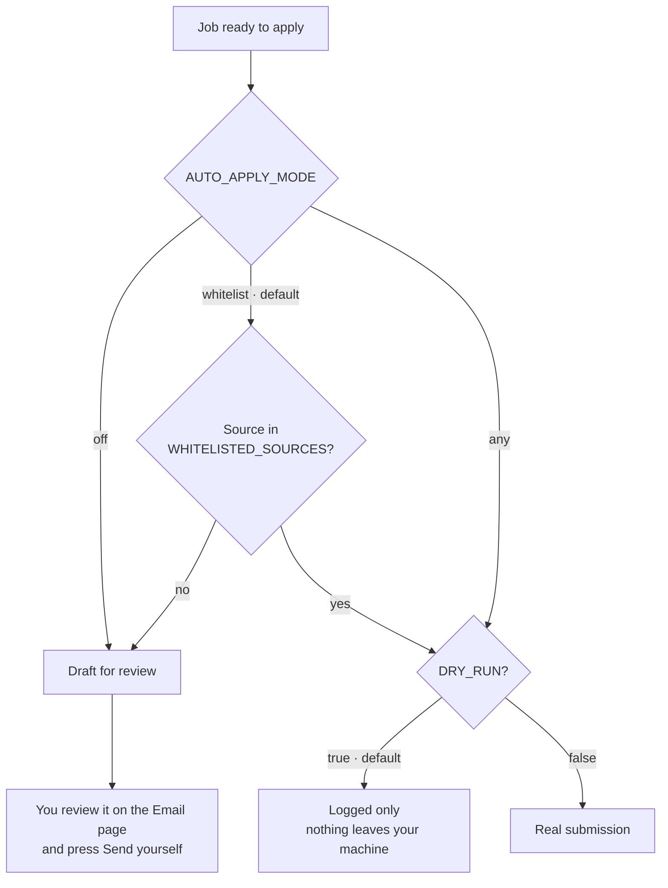
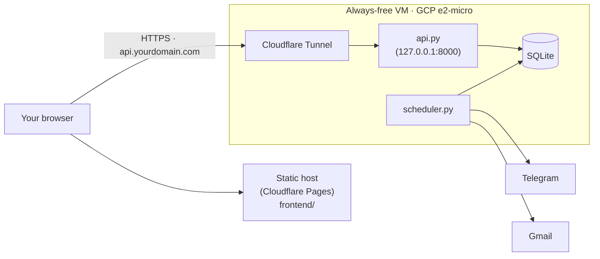

<p align="center">
  
</p>

<h1 align="center">Sa'ei · ساعي</h1>
<p align="center"><em>Your AI career companion. It searches, matches and tailors for you, and applies only where you allow it.</em></p>

---

## The idea

Job hunting is mostly repetitive work. You check the same boards every day,
read postings to decide whether they fit, rewrite your CV for each one, fill
in forms, and track what you sent where. **Sa'ei** (Arabic *ساعي*, "the one
who strives", also "the messenger") is a set of AI agents that does that work
for you every day. Three rules shape how it behaves:

1. **It never makes things up.** Your CV becomes one structured *profile*,
   and that profile is the only thing any agent reads. A tailored CV
   rephrases your real experience in the posting's own words. It never adds
   skills you don't have; missing skills are reported as gaps instead.
2. **Every score can be explained.** A match score or ATS score is never a
   number the model made up. It's computed in Python from evidence, and every
   point traces back to a specific line of your CV.
3. **You decide what gets sent.** By default nothing is sent at all (dry
   run). When sending is on, the agent submits automatically only on job
   boards you've explicitly whitelisted. Everything else is prepared as a
   complete draft and waits for your approval.

Everything runs on free tools: local or free-tier AI models, public job-board
APIs, your own Gmail, and a Telegram bot.

---

## How it works at a glance



A day in the life (all times are local, from `scheduler.py`):



---

## Core concepts

### 1. Your profile is the single record of you

Uploading a CV extracts a structured profile (contact, summary, experience,
projects, education, certifications, skills). **Every stage reads the
profile, not the file**, so a correction you make on the Profile page
reaches search, ranking, scoring and tailoring the next time they run.



> ⚠️ Uploading a new CV **replaces** the profile, including your hand edits.
> To pick up changes from the file without losing edits, use
> **Profile → Re-extract from CV**, which previews what would change first.

### 2. Finding jobs: search wide, then rank carefully

Job boards describe the same role in a dozen different ways, so finding jobs
is split into two stages tuned in opposite directions. **Retrieval** favours
recall (don't miss anything plausible). **Ranking** favours precision (put
the best fits first).



The **semantic path** is what catches a "Backend Developer" posting during a
"Software Engineer" search when the content genuinely fits you. Only jobs the
title filter rejects are embedded; a job it already accepted isn't paid for
twice.

**The match score** answers *"is this job right for me?"*. It's a weighted
sum of eight factors. Ranking deliberately uses no LLM, so ordinary search
volume never uses up a free-tier quota.



When a posting doesn't state something (salary and location often aren't
listed), that factor scores **neutral, not zero**. A job isn't penalised for
how its source happens to format postings.

### 3. The ATS score: requirement by requirement, fully explained

The ATS score answers a different question: *"would my CV get through this
employer's screening?"* Rather than counting keywords, the ATS agent
(`agents/ats_agent.py`):

1. extracts every requirement from the posting (one LLM call),
2. matches each requirement against your profile in up to three layers,
   stopping as soon as one layer decides,
3. computes the final score **in Python** from a credit table. No number a
   model returns ever reaches the score.



How the final number is weighted (`config.JOB_MATCH_WEIGHTS`):



Buckets a posting doesn't mention (no education line, say) are left out, and
their weight is spread over the rest. Inside a bucket, a *required* skill is
worth more points than a *preferred* one. Separately, a **parse-compatibility
check** (headers, length, bullet consistency, sections) grades the CV
*document* Pass / Warning / Fail, since that's a property of the file, not of
any one job.

Every **Why?** button in the dashboard opens this breakdown: each
requirement, how it matched (exact / alias / prerequisite / semantic / not
found), the points it earned, and the CV line that proves it. It's built from
the scoring pass itself, so explaining a score costs no extra LLM call.

Details: [MATCHING.md](MATCHING.md) (the matcher) and
[SCORING.md](SCORING.md) (the scoring pipeline, with a worked example).

### 4. What happens to each job

Every job that passes the match gate goes through a small LangGraph state
machine (`orchestrator.py`):



The tailored CV is scored again against the same requirements, which costs
one extra call rather than two. You see both numbers side by side, so you can
check how much the tailoring actually helped.

### 5. Who is allowed to press "send"



---

## The dashboard

`frontend/` is a static site: open `index.html` or serve the folder. It
talks to the FastAPI backend in `api.py`, and its design comes from the
**Sa'ei** project in Stitch.

| Page | What it's for |
|---|---|
| **Dashboard** | Stats, the pipeline stepper showing where things stand, top opportunities with an inline match audit, drafts awaiting review, top skill gaps, agent activity log |
| **Search** | Target role, seniority, freshness and per-site limits; the list of job boards; *Launch discovery* to run the pipeline now; latest discoveries |
| **Applications** | Every application, filterable, with an audit panel: ATS and match score rings, match breakdown, requirement evidence |
| **CV Studio** | Master CV, upload, every tailored CV with its score change, and an **ATS & tailoring bench**: paste a job description and see the score and rewrite without saving anything |
| **Profile** | Edit the extracted profile that every agent reads |
| **Email** | Connect Gmail (OAuth), review pending drafts, send, view sent/failed history |
| **Reports** | Skill-gap bars, the latest news digest, every Telegram report sent |
| **Features** | The pipeline stages and the agent roster, each with one live number |
| **Settings** | Auto-apply mode cards, ATS thresholds, LLM provider and keys, job-matching tuning |

Styling uses Tailwind, shipped **pre-compiled** as `frontend/tailwind.css`,
and fonts are stored in the repo, so the dashboard needs no CDN and no build
step to run. Only after you change Tailwind classes, rebuild from
`frontend/`:

```bash
npx tailwindcss@3 -c tailwind.config.js -i tailwind.src.css -o tailwind.css --minify
```

The dashboard is desktop-only (minimum width 1100px).

---

## Getting started

### 1. Install

```bash
# venv
python -m venv .venv && .venv\Scripts\activate      # source .venv/bin/activate on macOS/Linux
pip install -r requirements.txt

# …or conda
conda env create -f environment.yml && conda activate job-agent
```

```bash
cp .env.example .env     # then fill in what you plan to use
```

With only that, it already runs in dry-run mode: Greenhouse and Lever need
no key, and `DRY_RUN=true` is the default.

### 2. Pick a language model (any one, all free)

| Provider | Setup | Good to know |
|---|---|---|
| **Ollama** (local) | `ollama pull qwen3:4b` | Unmetered and private. A non-thinking instruct model (e.g. `qwen2.5:7b-instruct`) avoids reasoning leaking into output. |
| **Gemini** | `GEMINI_API_KEY` | Free tier; the same key can also do embeddings. |
| **Groq** | `GROQ_API_KEY` | Fastest hosted option. Capped at **200k tokens/day**. |
| **OpenRouter** | `OPENROUTER_API_KEY` | ~400 models. `:free` ids are capped at **50 requests/day** (~15–20 jobs). |

For semantic matching, also run `ollama pull nomic-embed-text` (or
`qwen3-embedding:4b` for Arabic and mixed-language postings). Without an
embedding model it still works; it just loses the semantic path's extra
recall. Everything here can also be changed on the **Settings** page.

### 3. Add your CV, then run

Upload your CV on **CV Studio** (or drop it at `cv/current_cv.pdf`).

| | Command |
|---|---|
| **Windows, one click** | `run.bat` (venv) or `run_conda_quick.bat` (conda). Starts the API and scheduler and opens the dashboard. |
| Run the pipeline once | `python jobs/daily_run.py` |
| Apply from one link | `python jobs/apply_from_link.py "https://boards.greenhouse.io/acme/jobs/123"` |
| Always-on scheduler | `python scheduler.py` |
| API + dashboard | `uvicorn api:app --port 8000` and `python -m http.server 5500 --directory frontend` |

Everything runs on your machine, so it stops when your machine sleeps. See
[Deployment](#deployment) to keep it running unattended.

---

## Enabling auto-submit

Auto-submit is meant to be verified **one employer at a time**, not switched
on everywhere at once:

1. Inspect that board's application form. Every Greenhouse/Lever board can
   have its own custom fields.
2. Implement its payload in `agents/apply_agent.py::auto_submit_greenhouse`.
   This is currently a deliberate stub.
3. Test with `DRY_RUN=true`, then on one real application with
   `DRY_RUN=false`.
4. Add `"greenhouse:<board_token>"` or `"lever:<company_slug>"` to
   `WHITELISTED_SOURCES`.

Related settings (Settings → *Auto-apply* and *ATS & tailoring*):
`AUTO_APPLY_MODE` (`off` / `whitelist` / `any`), `FIT_THRESHOLD` (default
70%, below which the CV gets tailored), and `AUTO_APPLY_ON_TAILORED_SCORE`
(off by default, because a higher score doesn't prove the rewrite overstated
nothing).

---

## Deployment

The frontend is static files, so any static host works (Cloudflare Pages,
Netlify, Vercel, GitHub Pages). The backend needs a real, persistent Python
process (SQLite, LangGraph, APScheduler), so serverless/WASM runtimes such as
Cloudflare Workers can't run it.



**Google Cloud, free tier:** scripts are in `deploy/gcp/`.

1. Create an `e2-micro` VM in `us-west1`, `us-central1` or `us-east1` with
   `--metadata-from-file=startup-script=deploy/gcp/startup-script.sh`. The
   script installs everything and registers `job-agent-api` and
   `job-agent-scheduler` as systemd services that restart on crash and start
   on reboot. For a private repo, put a token in `REPO_URL` first.
2. SSH in and fill `/opt/job-agent/.env`. Use `LLM_PROVIDER=gemini`, since
   1 GB of RAM can't run Ollama. Copy `credentials/*.json` over with
   `gcloud compute scp`, then
   `sudo systemctl restart job-agent-api job-agent-scheduler`.
3. Install `cloudflared`, create a tunnel, and fill in
   `deploy/gcp/cloudflared/config.yml.example` as
   `/etc/cloudflared/config.yml`. The API gets a public HTTPS URL without
   opening any port.
4. Set `API_BASE` in `frontend/config.js` to that URL and redeploy the
   frontend.

To check that scheduled runs fire: `journalctl -u job-agent-scheduler -f`.

---

## Project layout

```
config.py / .env        settings (the Settings page writes .env via env_store.py)
models.py / db.py       SQLite schema + sessions
cv_parser.py            PDF/DOCX → text
profile_store.py        the stored profile every stage reads
orchestrator.py         LangGraph state machine for one job
scheduler.py            08:00 search · 20:00 report · Mon 09:00 news
api.py                  FastAPI backend for the dashboard
agents/                 search · query_expansion · ranking · ats · cv_rewriter/render/targeting
                        apply · email · reporter · news · skill_gap
                        + matcher internals: skill_matching, semantic_matching,
                          evidence_retrieval, requirement_normalizer, embeddings, llm
services/               embedding cache + per-CV semantic index
jobs/                   entry points: daily_run, daily_report, weekly_news, apply_from_link
frontend/               the Sa'ei dashboard (9 pages + shell.js, ui.js, config.js)
bench/                  labelled matching cases, precision/recall + calibration
tests/                  pytest suite
deploy/gcp/             VM startup script, systemd units, cloudflared config
ARCHITECTURE.md         file-by-file technical deep-dive
MATCHING.md             how a CV is matched against a job description
SCORING.md              the ATS scoring pipeline, with a worked example
```

## Testing

```bash
pytest                              # whole app: whitelist enforcement, dedup, profile-first pipeline, matcher layers…
python -m bench.report              # matcher precision/recall + score regression
python -m bench.report --calibrate  # re-derive semantic thresholds after changing embedding model
```

## Tech stack (all free)

| Layer | Tools |
|---|---|
| Orchestration | LangGraph, APScheduler |
| LLM | Ollama · Gemini · Groq · OpenRouter |
| Embeddings | Ollama `nomic-embed-text` / `qwen3-embedding:4b` · Gemini `gemini-embedding-001` |
| Job sources | Greenhouse & Lever APIs, RemoteOK, We Work Remotely, SerpAPI (optional), Google Sheets watchlist, scraped career pages |
| Documents | `pdfplumber`, `python-docx`, `reportlab` |
| Delivery | Gmail API (OAuth), Telegram Bot API |
| Storage / API | SQLite + SQLAlchemy, FastAPI |
| Frontend | Static HTML/JS + pre-compiled Tailwind |

## Cautions

- **Respect each board's Terms of Service.** Use public APIs or sites that
  allow access. LinkedIn and Indeed block automated requests and are
  deliberately not supported.
- **Rate-limit yourself.** Too many automated requests can get an IP or
  account flagged.
- **Scale auto-submit slowly.** Start with drafts everywhere, then whitelist
  one board at a time.
- **Scores from before 2026-08-26 aren't comparable.** They came from the
  retired four-pillar engine. Recalibrate `FIT_THRESHOLD` from real runs.
